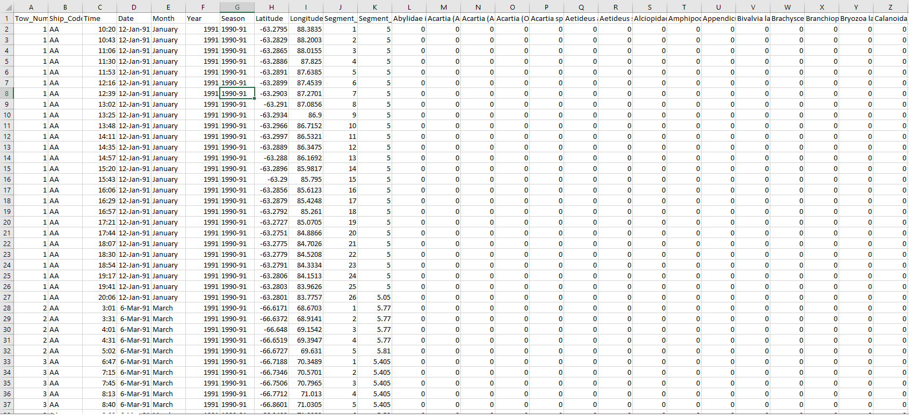
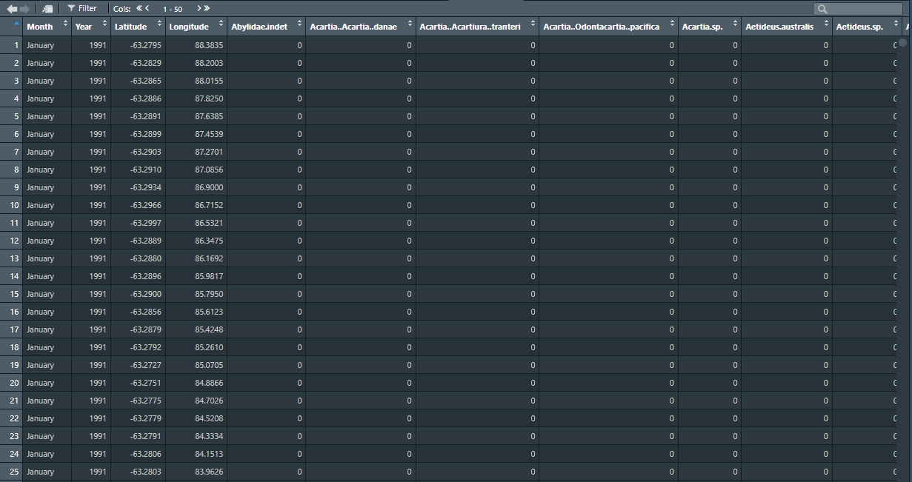
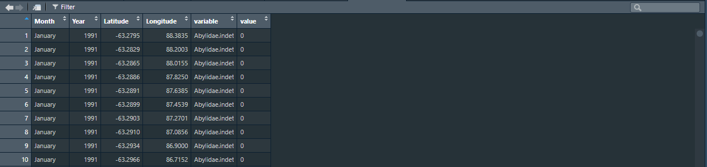

This markdown document will provide you with a step by step process on how to make maps using the package ggplot2. The first step for any project, is to organise our files and set our working directory. I usually make a new folder on my desktop where all my data, code and outputs will go. In this example, I have made a folder called "Making Maps". To set the working directory use the "Session" dropdown at the top of R studio, choose "Set Working Directory", and then "Choose Directory". Navigate to the folder you have created and press "open". Save all the data you need into this folder, so it is easy to access.

### Install and load packages {style="steelblue"}

The next step is to load the packages that you will need - these are below. You might need to install some of these before you can load them. This is done using the "install packages..." button under the "tools" dropdown at the top of R Studio. Installing "SOmap" is a little different. The code to install this package is below

```{r message=FALSE, warning=FALSE, results='hide'}
install.packages("SOmap", repos = c(SCAR = "https://scar.r-universe.dev",
                                    CRAN = "https://cloud.r-project.org"))
```

Once all packages are installed, run the code below

```{r message=FALSE, warning=FALSE}
library(ggplot2)
library(xfun)
library(ggtext)
library(dplyr)
library(reshape)
library(showtext)
library(ggthemes)
library(plotly)
library(maps)
library(mapdata)
library(SOmap)
library(mapview)
```

### Loading data {style="steelblue"}

Next, we will need our data. For this example, I have used Continuous Plankton Recorder zooplankton data taken from the AADC - <https://data.aad.gov.au/metadata/records/AADC-00099>. The data is downloaded as a .csv file, which is great for using in R. If opened in Excel, the data should look like the image below.

{width="716"}

We need to load this data set into our R work space. When loading the data in, it will be turned into whats called a "data frame". We use the code below to load it in. In the code, we are telling R to make a data frame called "data", and we are using the "read.csv" function to find our file. If you have set your working directory correctly and saved the .csv into that folder, you should be able to find the file easily. Inside the parentheses, type "" and then press the tab button. This will show you the files that are currently in your working directory, and you can navigate to your desired .csv file.

```{r message=FALSE, warning=FALSE}
data <- read.csv("AADC_Zoop_CPR_Data.csv")
```

A data frame has now been created, and will appear in the top right of your work space (image below)


We can click on this data frame and it will open in R, showing us our rows, columns and values.

### Cleaning the data {style="steelblue"}

The columns we are interested in keeping for our map are "Month", "Year", "Latitude", "Longitude" and all the species columns at the end. To use this data effectively in a map, we need to remove the columns we don't want. We can do this with the line of code below. Instead of cleaning the original data frame, I have decided to make a new data frame called "data_clean". This means we will keep the original data frame untouched, and our clean up will happen on a new data frame. The reason for keeping the original data frame will become important later on.

```{r message=FALSE, warning=FALSE}
data_clean = subset(data, select = -c(1, 2, 3, 4, 7, 10, 11))
```

In the code above, we are asking R to grab our data frame, and make a subset of it (into a new data frame). when we use "-c", we are asking R to remove columns for us. The columns we want removed are chosen by the numbers in the parentheses. Once you run this code, the data frame should now look like the image below

Currently, each species has its own column. For mapping data points in ggplot, it is much easier if all species are in the one column. This makes it easier for us to select individual species for mapping, as well as plotting different species abundance against one another. To do this, we need to "melt" the data frame, which is done in the code below.

```{r message=FALSE, warning=FALSE}
data_clean <- melt(data_clean, id = c("Month", "Year", "Latitude", "Longitude"))
```

We are asking R to take the data frame, and stack the species columns on top of each other. We do not want to stack the columns "Month", "Year", "Latitude", and "Longitude", so we mention this in the code above. R stacks the species in a new column and calls it "variable." It also makes a new column called "value" which is the abundance count for each species at each lat/long. The result should look like the image below.



If you scroll down through the data frame, you will now see that each species is stacked, starting with Abylidae, and then onto Acartia etc. The next step we take, is to change the column names. This is not necessary, but it makes the data frame easier to read - code below

```{r message=FALSE, warning=FALSE}
colnames(data_clean)[5] = "Species"
colnames(data_clean)[6] = "Abundance"
```

Next, we want to remove 0's from our data. This is done with the code below

```{r message=FALSE, warning=FALSE}
data_clean = data_clean[data_clean$Abundance > 0.1,]
```

### Making a species specific data frame {style="steelblue"}

Now that our data is ready, we can start to target a specific species. To do this, we need to make a separate data frame. Let's say we want to target *Calanus propinquus*- we need to know exactly how it is spelt in our data frame. We can do this by clicking on our data frame and using the search function in the top right. Once we know how it is spelt, we use the dplyr filter function to make a new data frame (shown below). We have called our new data frame "Cal_prop". If successful, you will see a new data frame appear in the top right window of your R program.

```{r message=FALSE, warning=FALSE, results='hide'}
Cal_prop <- dplyr::filter(data_clean, Species == "Calanus.propinquus")
```

We can "glimpse" our new data frame to see how R processes and uses each column. We do this using the following code

```{r}
glimpse(Cal_prop)
```

This tells me that the values in the "Month" column are considered characters. You can see the \<chr\> in grey. It considers "Year" values as integers \<int\>, and "Latitude" as double vectors \<dbl\> etc. "Abundance" is currently seen as a character. We need to ensure it is an integer, before we move on, otherwise all manipulation of numbers won't work well. We do this with the code below

```{r}
Cal_prop$Abundance = as.integer(Cal_prop$Abundance)
```

If we glimpse our data again, we can see it has changed.

```{r}
glimpse(Cal_prop)
```

Now we can start to build our map using ggplot. There are a few steps we need to take to make sure the map works. Firstly, we need to give ggplot some data for mapping the world. When installing our packages, we installed one called "mapworld". We are going to make a data frame using data from this package with the code below. We call this data frame "world".

```{r message=FALSE, warning=FALSE, results='hide'}
world <- map_data("world")
```

We should now have 4 data frames. These are "data", "data_clean", "Cal_prop" and "world".

### Making a simple map and setting boundaries

We are going to make a simple plot to see if everything is working as it should be. In the first line of code, we are asking ggplot to make a plot. The "+" symbol tells ggplot that we want to add more to this plot. In the second line, the "geom_polygon" function allows us to fill the plot space with data. under "data" we are choosing the recently made "world" data frame. The "aes" function lets us determine how the X and Y axis are filled. In this case, we use long and lat to fill x and y. These values come from the "world" data frame. We want to outline the countries with colour the "darkgrey", and fill them with the colour "grey". The alpha value controls the transparency of the data points (in this case, the world map). A value of 1 makes data points completely solid, where as 0.5 would make data points halfway transparent.

```{r message=FALSE, warning=FALSE, results='hide'}
ggplot() +
    geom_polygon(data = world, aes(x=long, y=lat, group=group), colour="darkgrey",fill="grey", alpha=1)

```

We don't need to see the whole world when our data is focused in the Southern Ocean. We can easily define our plot boundaries by adding a new line at the end of our code. I have chosen an x limit (xlim) and y limit (ylim) that correspond to our lats and longs of interest. You will notice that a "+" symbol has been added to the end of the previous line of code. This tells ggplot that we want to keep adding more to our plot - you must ensure that each line of code finishes with "+", except for the very last line. We only need to map between 50 and 160 east, and -30 and -70 south, so these values are entered into the code below. The coordinates line of code (coord_sf) is usually the last line of code for the plot, so anytime you want to add new lines of code, make sure they go above this line.

```{r message=FALSE, warning=FALSE, results='hide'}
ggplot() +
    geom_polygon(data = world, aes(x=long, y=lat, group=group), colour="darkgrey",fill="grey", alpha=1) +
    coord_sf(xlim = c(50,160), ylim=c(-70,-30))
```

### Adding data points and a legend to our map

Now, we can start to add data points. The code below can be copied, pasted and reused - as long as what you enter after "data" (in the geom_point line of code) corresponds to your data frame, and "x" and "y" correspond to values within that data frame. For example, the value for "x" is "Longitude". That is exactly how it is spelt in my data frame. Putting a value of "long" or "longitude" (not capitalized), would cause an error. I have put the data frame "Cal_prop" into the data prompt.

If we want a legend to be added with our data, we need to tell R what each data point is to be called, and what colours are to be used. We do this with the "scale_color_manual" function. Firstly, we make sure the "colour" argument lies within the aes() brackets in our geom_point line. Within this colour argument, we type what we want the data point to be called - in this instance, it's "Calanus propinquus". Finally, we add a scale_color_manual line towards the end of our code, to tell R what colour we want our data points to be.

For our first set of data, I have chosen "deepskyblue4" as the colour for these points, but this can be easily changed to another colour. <https://derekogle.com/NCGraphing/resources/colors> provides a great resource for colours in R. If using Hexadecimal colours, make sure you place a "\#" before the text.

```{r message=FALSE, warning=FALSE, results='hide'}
ggplot()+
  geom_polygon(data = world, aes(x=long, y=lat, group=group), colour="darkgrey",fill="grey", alpha=1) +
  geom_point(data=Cal_prop, aes(x=Longitude, y=Latitude, colour="Calanus propinquus"), pch=20, size=2) +
  scale_color_manual(values = c("Calanus propinquus" = "steelblue4")) +
  coord_sf(xlim = c(50,160), ylim=c(-70,-30))
```

The position of the legend is squishing our plot too much, and it is too small. We want to move the legend to the bottom, get rid of the word "colour", and change the size of the legend text. We can do all of these things with the following line.

theme(legend.title = element_blank(), legend.position = "bottom", legend.text=element_text(size=12))

When added to our map, it looks like this:

```{r message=FALSE, warning=FALSE, results='hide'}
ggplot()+
  geom_polygon(data = world, aes(x=long, y=lat, group=group), colour="darkgrey",fill="grey", alpha=1) +
  geom_point(data=Cal_prop, aes(x=Longitude, y=Latitude, colour="Calanus propinquus"), pch=20, size=2) +
  scale_color_manual(values = c("Calanus propinquus" = "steelblue4")) +
theme(legend.title = element_blank(), legend.position = "bottom", legend.text=element_text(size=12)) +
  coord_sf(xlim = c(50,160), ylim=c(-70,-30))
```

### Adding CPR sampling effort

The map above shows us the occurrence of *Calanus propinquus* from CPR records, but it doesn't show us all CPR effort. We need to understand where the CPR sampled and *didn't* find *Calanus propinquus* to be able to make any assumptions about the data. To do this, we need to also map all CPR samples by adding another line of code. This is the main reason that we kept the original "data" data frame as it was.

The new line of code is below:

geom_point(data=data, aes(x=Longitude, y=Latitude), colour="grey", pch=20, size=2) +

This line of code is very similar to the code that produced our *Calanus* data points, with two small changes. Under the "data" prompt, instead of "Cal_prop" like before, we have chosen the "data" data frame. We have also changed the colour from "steelblue4" to "grey", so we can differentiate between the two data sets. I have placed the colour argument *outside* of the aes() brackets. I have done this because I don't want the sampling effort to show up on our legend. This line of code goes directly under the geom_polygon line (which mapped the world), as I think it should be the first thing we place after the world map. When put all together, this is the result:

```{r message=FALSE, warning=FALSE, results='hide'}
ggplot()+
  geom_polygon(data = world, aes(x=long, y=lat, group=group), colour="darkgrey",fill="grey", alpha=1) +
    geom_point(data=data, aes(x=Longitude, y=Latitude), colour="grey", pch=20, size=2) +
  geom_point(data=Cal_prop, aes(x=Longitude, y=Latitude, colour="Calanus propinquus"), pch=20, size=2) +
  scale_color_manual(values = c("Calanus propinquus" = "steelblue4")) +
 theme(legend.title = element_blank(), legend.position = "bottom", legend.text=element_text(size=12)) +
  coord_sf(xlim = c(50,160), ylim=c(-70,-30))
```

### Cleaning the map

This map looks okay, but it is quite messy and hard to read. One way to clean up the data, is to group the lat and long into rounded numbers. For example, instead of one data point at -52.0365, and another data point at -52.0347, both data points are now grouped as -52. This means you will lose some resolution in the data, but it becomes much easier to visualize. Whether you do this or not, depends on the question you are trying to answer. When rounding lat and long, we do this to all of our data frames, including the "data", "data_clean", and the "Cal_prop" data frame. The code to round the lat and long is below

```{r message=FALSE, warning=FALSE, results='hide'}
data <- dplyr::mutate(data, Latitude = round(Latitude, digits = 0))
data <- dplyr::mutate(data, Longitude = round(Longitude, digits = 0))
data_clean <- dplyr::mutate(data_clean, Latitude = round(Latitude, digits = 0))
data_clean <- dplyr::mutate(data_clean, Longitude = round(Longitude, digits = 0))
Cal_prop <- dplyr::mutate(Cal_prop, Latitude = round(Latitude, digits = 0))
Cal_prop <- dplyr::mutate(Cal_prop, Longitude = round(Longitude, digits = 0))
```

Once this is done, we can re run our map code, and see how it looks.

```{r message=FALSE, warning=FALSE, results='hide'}
ggplot()+
  geom_polygon(data = world, aes(x=long, y=lat, group=group), colour="darkgrey",fill="grey", alpha=1) +
    geom_point(data=data, aes(x=Longitude, y=Latitude), colour="grey", pch=20, size=2) +
  geom_point(data=Cal_prop, aes(x=Longitude, y=Latitude, colour="Calanus propinquus"), pch=20, size=2) +
  scale_color_manual(values = c("Calanus propinquus" = "steelblue4")) +
  theme(legend.title = element_blank(), legend.position = "bottom", legend.text=element_text(size=12)) +
  coord_sf(xlim = c(50,160), ylim=c(-70,-30))
```

This looks much better. To create more contrast between CPR data points and our species data points, we can change the size of the data points. For this example, let's change the size of the CPR data points from 2 to 1. We make this change in the "size=" argument in our target line, which in this case is the first "geom_point" line.

```{r message=FALSE, warning=FALSE, results='hide'}
ggplot()+
  geom_polygon(data = world, aes(x=long, y=lat, group=group), colour="darkgrey" ,fill="grey", alpha=1) +
  geom_point(data=data, aes(x=Longitude, y=Latitude), colour="grey", pch=20, size=1) +
  geom_point(data=Cal_prop, aes(x=Longitude, y=Latitude, colour="Calanus propinquus"), pch=20, size=2) +
  scale_color_manual(values = c("Calanus propinquus" = "steelblue4")) +
theme(legend.title = element_blank(), legend.position = "bottom", legend.text=element_text(size=12))+
  coord_sf(xlim = c(50,160), ylim=c(-70,-30))
```

### Adding a figure title

We will now need to add a plot title. We can do this with the line of code below - this also sets the size of the title text. I have chosen size 22 for the main title, and 18 for the sub title.

labs(title = "Calanus Propinquus", subtitle = "Southern Ocean distribution", plot.title = element_text(size=22), plot.subtitle = element_text(size=18))

When added to our map..

```{r}
ggplot()+
  geom_polygon(data = world, aes(x=long, y=lat, group=group), colour="darkgrey" ,fill="grey", alpha=1) +
  geom_point(data=data, aes(x=Longitude, y=Latitude), colour="grey", pch=20, size=1) +
  geom_point(data=Cal_prop, aes(x=Longitude, y=Latitude, colour="Calanus propinquus"), pch=20, size=2) +
  scale_color_manual(values = c("Calanus propinquus" = "steelblue4")) +
theme(legend.title = element_blank(), legend.position = "bottom", legend.text=element_text(size=12))+
    labs(title = "Calanus Propinquus", subtitle = "Southern Ocean distribution", plot.title = element_text(size=22), plot.subtitle = element_text(size=18)) +
  coord_sf(xlim = c(50,160), ylim=c(-70,-30))
```

### Adding more species

We can easily add another species to our map by following some previous steps from above. Firstly, we make a new data frame with our next target species - let's choose *Euphausia vallentini*. Because we have already rounded the lat and long in our "data_clean" file, we don't need to do this again, as this is where our new data comes from.

```{r message=FALSE, warning=FALSE, results='hide'}
Euph_val <- dplyr::filter(data_clean, Species == "Euphausia.vallentini")
```

Once we have our new species data frame, we can add a new line of code to our map. We can copy and paste the *Calanus Propinquus* "geom_point" line, and change two variables. We change data from "Cal_prop" to "Euph_val" and we change the colour from "Calanus propinquus" to "Euphausia vallentini". We then go to our "scale_color_manual" line and add a new colour. You can also change the title to reflect the new species being added. When you add the new geom_point line, change the title and add the new colour to the scale_colour_manual line, the overall code looks like this:

```{r message=FALSE, warning=FALSE, results='hide'}
ggplot()+
  geom_polygon(data = world, aes(x=long, y=lat, group=group), colour="darkgrey",fill="grey", alpha=1) +
  geom_point(data=data, aes(x=Longitude, y=Latitude), colour="grey", pch=20, size=1) +
  geom_point(data=Cal_prop, aes(x=Longitude, y=Latitude, colour="Calanus propinquus"), pch=20, size=5, alpha=0.5) +
  geom_point(data=Euph_val, aes(x=Longitude, y=Latitude, colour="Euphausia vallentini"), pch=20, size=5, alpha=0.5) +
  scale_color_manual(values = c("Calanus propinquus" = "steelblue4", "Euphausia vallentini" = "olivedrab4")) +
  theme(text = element_text(family="Calibiri"), legend.title = element_blank(), legend.position = "bottom", legend.text=element_text(size=12)) +
  labs(title = "Calanus Propinquus + Euphausia vallentini", subtitle = "Southern Ocean distribution", plot.title = element_text(size=22), plot.subtitle = element_text(size=18)) +
  geom_sf(data=fronts, inherit.aes = FALSE, colour = "darkgrey") +
  coord_sf(xlim = c(50,160), ylim=c(-70,-30))
```

### Adding SO fronts to the map

The SOmap package includes Southern Ocean fronts built into the package. Because we have installed and loaded that package, we can borrow these fronts for our map. We do this with the code below. This makes a data frame called "fronts".

```{r message=FALSE, warning=FALSE, results='hide'}
fronts <- SOmap_data$fronts_park
```

We can then add this to our map using a "geom_sf" line near the end of our code.

```{r message=FALSE, warning=FALSE, results='hide'}
plot <- ggplot()+
  geom_polygon(data = world, aes(x=long, y=lat, group=group), colour="darkgrey",fill="grey", alpha=1) +
  geom_point(data=data, aes(x=Longitude, y=Latitude), colour="grey", pch=20, size=1) +
  geom_point(data=Cal_prop, aes(x=Longitude, y=Latitude, colour="Calanus propinquus"), pch=20, size=2) +
  geom_point(data=Euph_val, aes(x=Longitude, y=Latitude, colour="Euphausia vallentini"), pch=20, size=2) +
  scale_color_manual(values = c("Calanus propinquus" = "steelblue4", "Euphausia vallentini" = "olivedrab4")) +
 theme(legend.title = element_blank(), legend.position = "bottom", legend.text=element_text(size=12)) +
  labs(title = "Calanus Propinquus + Euphausia vallentini", subtitle = "Southern Ocean distribution", plot.title = element_text(size=22), plot.subtitle = element_text(size=18)) +
  geom_sf(data=fronts, inherit.aes = FALSE, colour = "darkgrey") +
  coord_sf(xlim = c(50,160), ylim=c(-70,-30))
```

### Mapping abundance instead of presence/absence

Next, we will map abundance of species instead of presence/absence. This gets a little more complicated - but it can be done with some tweaking. We will focus on one species for this, *Calanus propinquus.* The first thing we do, is change the geom_point line of our code that uses the "Cal_prop" data set. We need to move the size argument from outside the aes() brackets, to inside. We then need to change the size value from "2" to "Abundance". This is telling ggplot to use the value found in the "Abundance" column of the data set to determine the size of the data point on the map. We then move the colour argument to the *outside* of the aes() brackets. To finish, change the colour from "Calanus propinquus" to "steelblue4" (or whatever colour you want). The difference in these two lines is below.

geom_point(data=Cal_prop, aes(x=Longitude, y=Latitude, colour="Calanus propinquus"), pch=20, size=2) +

geom_point(data=Cal_prop, aes(x=Longitude, y=Latitude, size=Abundance), colour="steelblue4", pch=20) +

Next, we need to get rid of the "Euphausia vallentini" = "olivedrab4" argument in the scale_color_manual line.

Lastly, we need to add a scale_size_continuous line. This tells R that we want to change the size of the data point, based on a value we give it. We need to give it breaks, which tells R where to break our "Abundance" values into different sized circles for our map. "labels" are the values shown on the legend. The break and label values need to be exactly the same for this to work. To choose what our breaks should be, we need to know what the Abundance data looks like for this species. To do this, we use the following code. This code asks us to check the 'Abundance" column in our "Cal_prop" data frame, and tell us how many times a certain abundance was recorded.

```{r}
 table(Cal_prop$Abundance)
```

This tells me that an Abundance of "1" was recorded 826 times. An abundance of "2" was recorded 328 times, and an abundance of "3" was recorded 157 times etc. Using this information, we can start to determine what our breaks will be. Because Abundance is skewed to lower numbers, my breaks will be closer together at the lower end, and spread out as Abundance grows. As a result, the code looks like this below. You can switch around with different breaks to see what works for your data frame.

scale_size_continuous(breaks=c(5, 10, 50, 250, 500, 750, 1000), labels=c(5, 10, 50, 250, 500, 750, 1000)) +

When you add these changes to your map, this is the final result.

```{r message=FALSE, warning=FALSE, results='hide'}
abundance <- ggplot()+
  geom_polygon(data = world, aes(x=long, y=lat, group=group), colour="darkgrey",fill="grey", alpha=1) +
  geom_point(data=data, aes(x=Longitude, y=Latitude), colour="grey", pch=20, size=1) +
  geom_point(data=Cal_prop, aes(x=Longitude, y=Latitude, size=Abundance), colour="steelblue4", pch=20) +
   geom_point(data=Euph_val, aes(x=Longitude, y=Latitude, size=Abundance), colour="olivedrab4", pch=20) +
  scale_color_manual(values = c("Calanus propinquus" = "steelblue4", "Euphausia vallentini" = "olivedrab4")) +
  scale_size_continuous(breaks=c(5, 10, 50, 250, 500, 750, 1000), labels=c(5, 10, 50, 250, 500, 750, 1000)) +
 theme(legend.title = element_blank(), legend.position = "bottom", legend.text=element_text(size=12)) +
  guides(size = guide_legend(nrow = 1)) +
  labs(title = "Calanus Propinquus + Euphausia superba", subtitle = "Abundance", plot.title = element_text(size=22), plot.subtitle = element_text(size=18)) +
  geom_sf(data=fronts, inherit.aes = FALSE, colour = "darkgrey") +
  coord_sf(xlim = c(50,160), ylim=c(-70,-30))
```

### Binning species abundance

Finally, we can bin our species abundance, to increase the emphasis on some areas of data. Choosing whether you map raw abundance - or bin your abundance to change emphasis - comes down to the question you're trying to answer. To bin our species, we can use the table results from before to choose how our bins will be grouped. They usually follow the breaks that you made earlier. When we bin our data, we are asking R to make a new column in our data frame and call it "abundance_bin". In the code below, we are telling R - if a number in the "Abundance" column is between 0 and 5, give it an "abundance_bin" value of 0.5. If a number in the "Abundance" column is between 6 and 10, give it an "abundance_bin" value of 1. if a number in the "Abundance" column is between 11 and 50, give it an "abundance_bin" value of 2 etc. The code is below.

```{r message=FALSE, warning=FALSE, result='hide'}
  Cal_prop <- Cal_prop %>% mutate(abundance_bin = case_when(
  Abundance >= 0 & Abundance <= 5 ~ 0.5,
  Abundance >= 6 & Abundance <= 10 ~ 1,
  Abundance >= 11 & Abundance <= 50 ~ 2,  
  Abundance >= 51 & Abundance <= 250 ~ 3,
  Abundance >= 251 & Abundance <= 500 ~ 4,
  Abundance >= 501 & Abundance <= 750 ~ 5,
  Abundance >= 751 ~ 6))
```

Once we have our data in bins, we just need to change two things in our map code. Firstly, we change the size argument in our geom_point line, from Abundance, to abundance_bin. We then change our breaks from (5, 10, 50, 250, 500, 750, 1000) to (0.5, 1, 2, 3, 4, 5, 6). We keep our labels untouched. Changing the breaks will ensure that these correspond to the "abundance_bin" values we made above.

```{r message=FALSE, warning=FALSE, results='hide'}
ggplot()+
  geom_polygon(data = world, aes(x=long, y=lat, group=group), colour="darkgrey",fill="grey", alpha=1) +
  geom_point(data=data, aes(x=Longitude, y=Latitude), colour="grey", pch=20, size=1) +
  geom_point(data=Cal_prop, aes(x=Longitude, y=Latitude, size=abundance_bin), colour="steelblue4", pch=20) +
  scale_color_manual(values = c("Calanus propinquus" = "steelblue4")) +
   scale_size_continuous(breaks=c(0.5, 1, 2, 3, 4, 5, 6), labels=c(5, 10, 50, 250, 500, 750, 1000)) +
 theme(legend.title = element_blank(), legend.position = "bottom", legend.text=element_text(size=12)) +
  guides(size = guide_legend(nrow = 1)) +
  labs(title = "Calanus Propinquus", subtitle = "Abundance", plot.title = element_text(size=22), plot.subtitle = element_text(size=18)) +
  geom_sf(data=fronts, inherit.aes = FALSE, colour = "darkgrey") +
  coord_sf(xlim = c(50,160), ylim=c(-70,-30))
```

### Saving maps

Once the maps are made, and they are showing in the plots tab in the bottom right of your R screen, you can export them. Clicking the Export button allow you to save them as an image or PDF. If you save as an image, you can choose the name, save directory and width and height of the map. For these maps, I change the width to 1299 and press tab. This will automatically change the height to ensure the image keeps the same aspect ratio. Once this is saved, you are done!

### Changing fonts

We can change the font of the titles and labels quite easily. First, we need to install and load the package "showtext".

```{r}
install.packages("showtext")
library(showtext)
```

All the fonts that your computer uses, are stored on your computer already, We just need to tell R where to find them. We use the "font_add" function to add a font to R. The code below is how we do this. The "Family" argument is what you want to call the font, when adding it to your ggplot. In this case, I have called it "Calibri". The next step is to see what the font file is actually called on your computer. To do this - on a windows computer - type "font" into the windows desktop search bar. This will take you to the computers font settings. Here type "Calibri" into the search bar, and then click on the font when it comes up. This will take you to the font details, where you will find the font name, and directory - for example: "C:\WINDOWS\FONTS\CALIBRI.TTF". The important part of this, is the "calibri.ttf". we add this to the "regular" argument in the code below. Run this code.

```{r}
font_add(family = "Calibri", regular = "Calibri.ttf")
showtext_auto()
```

Now, we go back to our "theme" line of code and add a little bit more - the new argument is:

theme(text = element_text(family = "Calibri"))

So when added to our original theme line, it looks like this:

theme(text = element_text(family = "Calibri"), legend.title = element_blank(), legend.position = "bottom", legend.text=element_text(size=12)) +

Once added to our plot, you will see that the font has changed.

```{r}
ggplot()+
  geom_polygon(data = world, aes(x=long, y=lat, group=group), colour="darkgrey",fill="grey", alpha=1) +
  geom_point(data=data, aes(x=Longitude, y=Latitude), colour="grey", pch=20, size=1) +
  geom_point(data=Cal_prop, aes(x=Longitude, y=Latitude, size=abundance_bin), colour="steelblue4", pch=20) +
  scale_color_manual(values = c("Calanus propinquus" = "steelblue4")) +
  scale_size_continuous(breaks=c(0.5, 1, 2, 3, 4, 5, 6), labels=c(5, 10, 50, 250, 500, 750, 1000)) +
 theme(text = element_text(family = "Calibri"), legend.title = element_blank(), legend.position = "bottom", legend.text=element_text(size=12)) +
  guides(size = guide_legend(nrow = 1)) +
  labs(title = "Calanus Propinquus", subtitle = "Abundance", plot.title = element_text(size=22), plot.subtitle = element_text(size=18)) +
  geom_sf(data=fronts, inherit.aes = FALSE, colour = "darkgrey") +
  coord_sf(xlim = c(50,160), ylim=c(-70,-30))
```

Luke Brokensha, October 2023

Thanks to the AADC and John Kitchener for the CPR zooplankton data    

```{r}
abunint <- ggplotly(abundance)
abunint

htmlwidgets::saveWidget(as_widget(abunint), "index.html")
```


